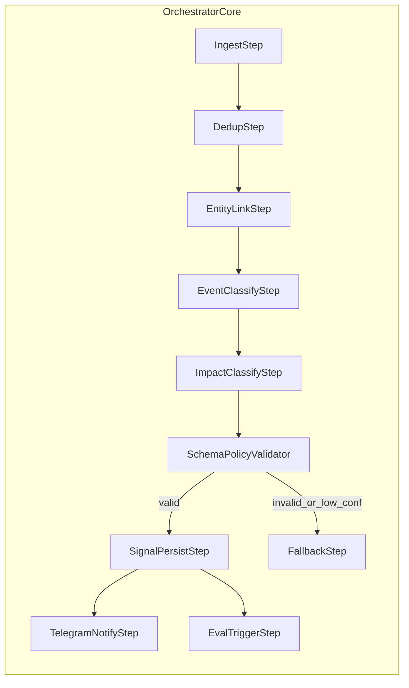

# C4 Component (Core Orchestrator)

```mermaid
flowchart LR
  subgraph orchestratorCore [OrchestratorCore]
    IngestStep["IngestStep"]
    DedupStep["DedupStep"]
    EntityStep["EntityLinkStep"]
    EventStep["EventClassifyStep"]
    ImpactStep["ImpactClassifyStep"]
    ValidateStep["SchemaPolicyValidator"]
    PersistStep["SignalPersistStep"]
    NotifyStep["TelegramNotifyStep"]
    EvalStep["EvalTriggerStep"]
    FallbackStep["FallbackStep"]
  end

  IngestStep --> DedupStep --> EntityStep --> EventStep --> ImpactStep --> ValidateStep
  ValidateStep -->|"valid"| PersistStep --> NotifyStep
  PersistStep --> EvalStep
  ValidateStep -->|"invalid_or_low_conf"| FallbackStep
```

This component view highlights policy control points and fallback routing inside the orchestration core.
