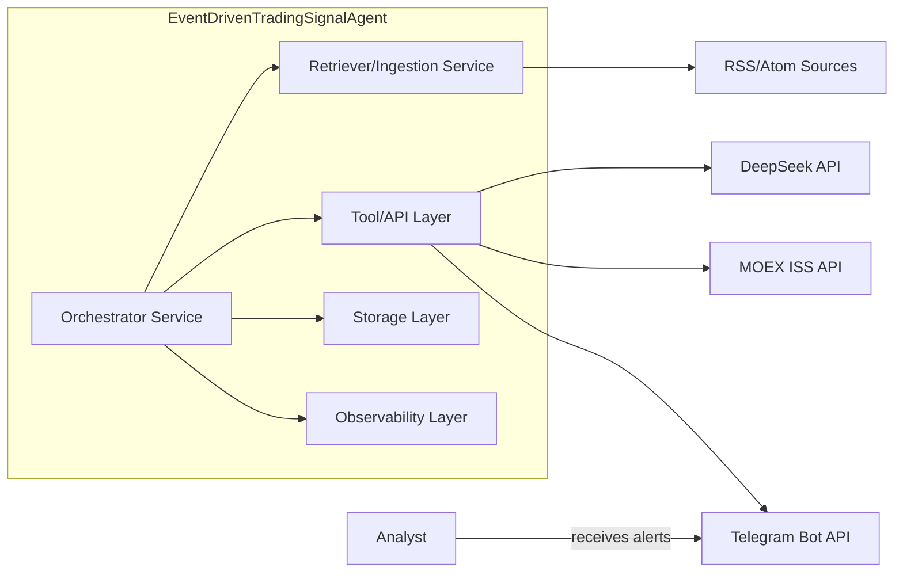

# C4 Container

```mermaid
flowchart LR
  User["Analyst"]

  subgraph coreSystem [EventDrivenTradingSignalAgent]
    Orchestrator["Orchestrator Service"]
    Retriever["Retriever/Ingestion Service"]
    ToolLayer["Tool/API Layer"]
    Storage["Storage Layer"]
    Observability["Observability Layer"]
  end

  RSS["RSS/Atom Sources"]
  LLM["DeepSeek API"]
  ISS["MOEX ISS API"]
  TG["Telegram Bot API"]

  User -->|"receives alerts"| TG
  Orchestrator --> Retriever
  Orchestrator --> ToolLayer
  Orchestrator --> Storage
  Orchestrator --> Observability
  Retriever --> RSS
  ToolLayer --> LLM
  ToolLayer --> ISS
  ToolLayer --> TG
```

Container view separates orchestration from retrieval, integrations, persistence, and telemetry.
