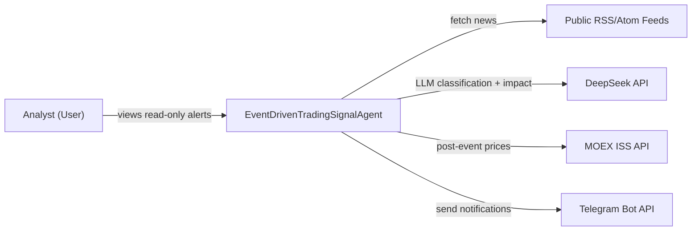

# C4 Context

```mermaid
flowchart LR
  Analyst["Analyst (User)"]
  System["EventDrivenTradingSignalAgent"]
  RSSFeeds["Public RSS/Atom Feeds"]
  DeepSeekAPI["DeepSeek API"]
  MoexIss["MOEX ISS API"]
  TelegramAPI["Telegram Bot API"]

  Analyst -->|"views read-only alerts"| System
  System -->|"fetch news"| RSSFeeds
  System -->|"LLM classification + impact"| DeepSeekAPI
  System -->|"post-event prices"| MoexIss
  System -->|"send notifications"| TelegramAPI
```

The system boundary includes ingestion, orchestration, validation, storage, and observability.
External systems are limited to public feeds, DeepSeek, MOEX ISS, and Telegram.
