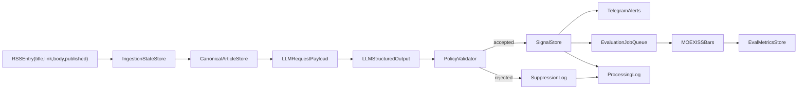

# Data Flow Diagram

Stored artifacts:
- ingestion metadata and dedup mappings;
- validated signals and suppression reasons;
- evaluation metrics and operational logs.

Logging policy and retention follow `docs/governance.md`.
