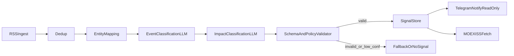

# Workflow / Graph Diagram

```mermaid
flowchart LR
  FeedIngest[RSSIngest] --> Dedup[Dedup]
  Dedup --> EntityMap[EntityMapping]
  EntityMap --> EventCls[EventClassificationLLM]
  EventCls --> ImpactCls[ImpactClassificationLLM]
  ImpactCls --> Validator[SchemaAndPolicyValidator]
  Validator -->|"valid"| SignalOut[SignalStore]
  SignalOut --> TelegramOut[TelegramNotifyReadOnly]
  SignalOut --> EvalFetch[MOEXISSFetch]
  Validator -->|"invalid_or_low_conf"| FallbackPath[FallbackOrNoSignal]
```

Fallback path policy:
- retry transient failures once;
- degrade to deterministic-only checks if possible;
- suppress signal with explicit reason if quality gate fails.
